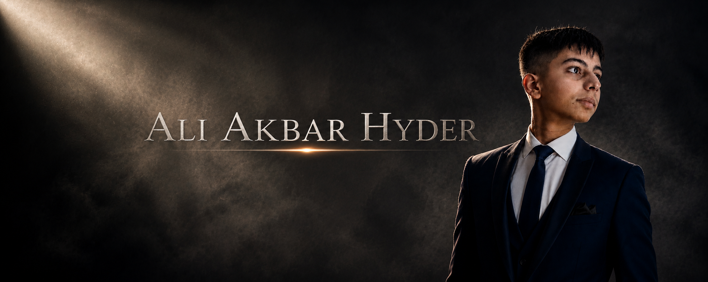

<!-- ============================================================= -->

<!--                    ALI AKBAR HYDER                            -->

<!--                     GITHUB PROFILE                            -->

<!-- ============================================================= -->

<p align="center">
  
</p>

<p align="center">
  
</p>

<p align="center">
  <a href="https://github.com/aliakbarhyder">
    
  </a>
  <a href="https://github.com/aliakbarhyder?tab=repositories">
    
  </a>
</p>

---

## 👨‍💻 About Me

<p align="center">
  
</p>

I'm an **AI enthusiast and developer** interested in building useful, creative, and technically interesting software.

My interests sit at the intersection of **artificial intelligence, software engineering, automation, computer vision, and creative technology**. I enjoy experimenting with new tools, understanding how things work, and turning ideas into projects that actually do something.

```text
              ┌──────────────┐
              │    IDEAS     │
              └──────┬───────┘
                     │
                     ▼
              ┌──────────────┐
              │  EXPERIMENT  │
              └──────┬───────┘
                     │
                     ▼
              ┌──────────────┐
              │    BUILD     │
              └──────┬───────┘
                     │
                     ▼
              ┌──────────────┐
              │   IMPROVE    │
              └──────┬───────┘
                     │
                     └──────↻
```

### ⚡ Currently Exploring

* 🤖 Artificial Intelligence & LLMs
* 💻 Software & Web Development
* 👁️ Computer Vision
* ⚙️ Automation
* 🧠 Human–Computer Interaction
* 🔬 Emerging Technologies
* 🚀 Turning ideas into real projects

---

# 🛠️ Technologies

### Languages

<p align="center">
  
</p>

### Frameworks & Development

<p align="center">
  
</p>

### AI & LLM Ecosystem

<p align="center">

`Ollama`  • 
`OpenRouter`  • 
`Groq`  • 
`Claude`  • 
`LLMs`  • 
`AI APIs`

</p>

---

# 🚀 Selected Projects

<table>
<tr>
<td width="50%" valign="top">

## 🪟 Airglass

A computer-vision interface designed around **camera and hand interaction**, allowing users to interact with an on-screen environment without relying entirely on traditional mouse and keyboard controls.

**Focus**

`Computer Vision` · `HCI` · `AI` · `Interactive UI`

</td>

<td width="50%" valign="top">

## ☁️ Skyline

A lightweight weather application designed around a clean and simple experience, making weather information easy to access.

**Built with**

`Python` · `Flask` · `HTML` · `CSS`

</td>
</tr>

<tr>
<td width="50%" valign="top">

## 🧠 JARVIS

An experimental personal AI assistant exploring the combination of **LLMs, automation, APIs, and interactive interfaces**.

**Focus**

`AI` · `LLMs` · `Automation` · `APIs` · `UI/UX`

</td>

<td width="50%" valign="top">

## 🔭 More Projects

Always experimenting with new ideas.

```text
██████████████████░░
       BUILDING...
```

New concepts are constantly being tested, refined, and turned into projects.

</td>
</tr>
</table>

---

# 🧠 What I'm Exploring

<p align="center">
  
</p>

```text
                   ARTIFICIAL INTELLIGENCE
                            │
             ┌──────────────┼──────────────┐
             ▼              ▼              ▼
           LLMs      COMPUTER VISION   AUTOMATION
             │              │              │
             └──────────────┼──────────────┘
                            ▼
                    AI APPLICATIONS
                            │
                            ▼
                     USEFUL SOFTWARE
```

---

# 📊 GitHub Analytics

<p align="center">
  
  
</p>

---

# 🔥 Contribution Streak

<p align="center">
  
</p>

---

# 📈 Activity

<p align="center">
  
</p>

---

# 💡 Philosophy

<p align="center">
  
</p>

> **Learn → Experiment → Build → Improve → Repeat**

---

# 🌐 Connect

<p align="center">
  <a href="https://github.com/aliakbarhyder">
    
  </a>
  <a href="https://www.linkedin.com/in/aliakbarhyder">
    
  </a>
</p>

---

<p align="center">
  
</p>

<p align="center">
  <sub>Built with curiosity, code, and an unreasonable number of terminal windows.</sub>
</p>

<p align="center">
  
</p>
