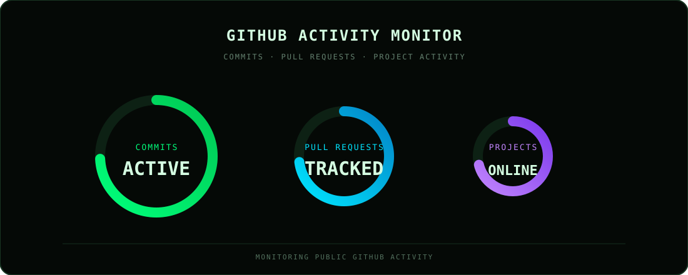

<!-- ================================================================ -->
<!--                       PROFILE README                            -->
<!-- ================================================================ -->

<div align="center">


</div>

<br />

<!-- ================================================================ -->
<!--                        SYSTEM TERMINAL                          -->
<!-- ================================================================ -->

<div align="center">



</div>

<br />

<!-- ================================================================ -->
<!--                           IDENTITY                              -->
<!-- ================================================================ -->

## `> whoami`

```text
Developer · Builder · Problem Solver

Exploring software development, AI, automation,
web technologies, and interesting systems worth building.
```

<br />

<div align="center">


</div>

<br />

---

## `> activity_monitor`

<div align="center">



</div>

<br />

```text
LIVE DEVELOPMENT SIGNAL
────────────────────────────────────────

Tracking public GitHub activity:

  ● Commits
  ● Pull Requests
  ● Issues
  ● Repositories
  ● Contributions
```

<div align="center">

`STATUS: SYNCHRONIZED`

</div>

<br />

---

## `> current_stack`

<div align="center">

| LANGUAGES | DEVELOPMENT | EXPLORING |
|:---:|:---:|:---:|
| Python | Git | AI Systems |
| JavaScript | GitHub | Web Development |
| HTML | APIs | Software Engineering |
| CSS | Automation | New Technologies |

</div>

<br />

---

## `> process_engine`

<div align="center">


</div>

<br />

```text
PROCESS ENGINE
────────────────────────────────────────

The current process rotates dynamically.

▸ ANALYZING SYSTEMS
▸ DEBUGGING REALITY
▸ COMPILING IDEAS
▸ EXECUTING LOGIC
▸ OPTIMIZING WORKFLOWS
▸ REFACTORING CHAOS
▸ DECODING PROBLEMS
▸ ARCHITECTING SOLUTIONS
▸ SIMULATING POSSIBILITIES
▸ DISCOMBOBULATING BUGS
▸ BUILDING SOMETHING INTERESTING
```

<br />

---

## `> currently_building`

<div align="center">


<br />

### Check it out →

### [aliakbarhyder9.pythonanywhere.com](https://aliakbarhyder9.pythonanywhere.com)

</div>

<br />

```text
IDEA
 │
 ▼
DESIGN
 │
 ▼
CODE
 │
 ▼
DEBUG
 │
 ▼
DEPLOY
 │
 ▼
IMPROVE
```

<br />

---

## `> projects`

<div align="center">

### ◈ AirGlass

```text
An experimental project focused on building and exploring
new ideas through software and technology.
```

### ◈ Jarvis

```text
An AI and automation-focused project exploring intelligent
systems, assistants, and software interaction.
```

### ◈ More Projects

```text
More experiments, tools, ideas, and systems
are always under construction.
```

</div>

<br />

---

## `> system_overview`

```text
PROFILE ENVIRONMENT
────────────────────────────────────────

SYSTEM        ONLINE
ENVIRONMENT   DEVELOPMENT
MODE          BUILDING
ACTIVITY      SYNCHRONIZED
AUTOMATION    ENABLED
SIGNAL        STABLE
```

<br />

```text
[✓] Profile initialized
[✓] Matrix subsystem active
[✓] Activity monitor synchronized
[✓] Animated assets loaded
[✓] Development environment operational
[✓] Projects detected
[✓] Ready for the next build
```

<br />

---

## `> architecture`

```text
aliakbarhyder/
│
├── .github/
│   └── workflows/
│       └── generate-assets.yml
│
├── assets/
│   │
│   ├── banner.png
│   │
│   └── generated/
│       ├── activity.svg
│       ├── matrix.svg
│       ├── skyline.svg
│       ├── status.svg
│       └── terminal.svg
│
├── scripts/
│   └── generate-assets.mjs
│
├── .gitignore
├── package.json
└── README.md
```

<br />

---

## `> automation_pipeline`

```text
SOURCE
   │
   ▼
generate-assets.mjs
   │
   ▼
GENERATED SVG SYSTEM
   │
   ├── terminal.svg
   ├── activity.svg
   ├── matrix.svg
   ├── status.svg
   └── skyline.svg
   │
   ▼
README.md
   │
   ▼
GITHUB PROFILE
```

<br />

---

## `> philosophy`

```text
BUILD

BREAK

DEBUG

IMPROVE

REPEAT
```

<br />

<div align="center">

```text
┌──────────────────────────────────────────────────────────────┐
│                                                              │
│                    SYSTEM STATUS: ONLINE                     │
│                                                              │
│                 BUILDING THE NEXT THING.                     │
│                                                              │
└──────────────────────────────────────────────────────────────┘
```

<br />


<br />

`01` `10` `01` `10` `01` `10` `01` `10` `01` `10`

</div>
